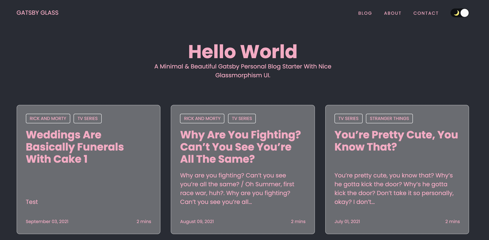

# Gatsby Starter Glass

A Minimal & Beautiful Gatsby Personal Blog Starter With Nice Glassmorphism UI.

[View Live Demo](https://gatsbyglass.netlify.app)



## Features

- Fully responsive
- SEO metadata and Open Graph tags
- Maximized lighthouse score
- Easy to deploy
- Syntax highlighting via PrismJS

## Local Install

```bash
# 1. Clone the repository
git clone [to be filled with actual repo]

# 2. Navigate into repository
cd gatsby-starter-glass

# 3. Install the dependencies
yarn install

# 4. Start the development server
yarn start

# 5. Start the build mode
yarn  build
```

## Configuration

Within gatsby-config.js, you can specify information about your site (metadata) like the site title and description to properly generate meta tags.

```js
// gatsby-config.js

module.exports = {
  siteMetadata: {
    title: `Gatsby Starter Glass`,
    author: {
      name: `Vui Chee`,
      summary: `self-taught front-end dev. jamstack enthusaist.`,
    },
    description: `A Minimal & Beautiful Gatsby Personal Blog Starter With Nice Glassmorphism Ui.`,
    siteUrl: `[To be updated]`,
    social: {
    },
  },

  // ...
}
```

## Deployment

- Generate a new repo from this repo which will copy all files from this repo to your newly created repo.

## Manually Editing contents

### Blog Posts

Blog contents can be updated in markdown format at `content/blog`. Delete placeholder posts and start blogging.

```md
---
title: Hello World
date: "2021-05-01"
description: "Hello World"
---

This top portion is the beginning of the post and will show up as the excerpt on the homepage.
```

### Pages

Homepage intro, Contact, and About page content can be updated in Markdown format at `content/pages`.

## Built with

- Gatsby for Static Site Generation
- Styled Component for styling
