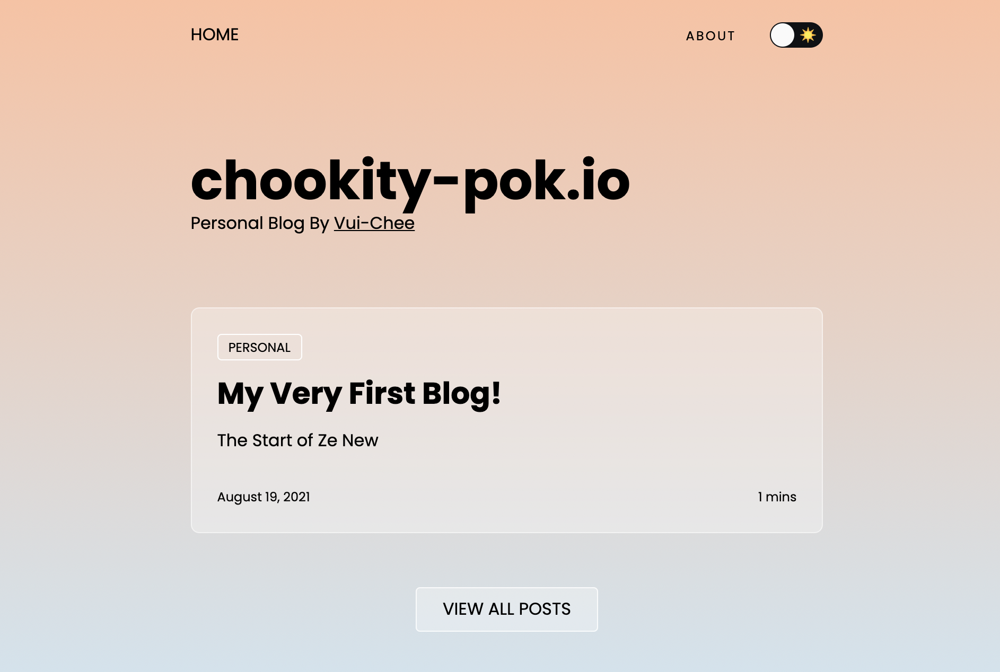

# chookity-pok.io

My personal website and blog. The theme is based off [gatsby-starter-glass](https://github.com/yinkakun/gatsby-starter-glass)
with tweaks such as converting to typescript, graphql codegen and other personal thematic changes.

To run locally, `yarn` and then `yarn dev`. Then navigate to http://localhost:8000.

### Note during Development

If you encounter the error `Unexpected problem - txn should abort` during `yarn dev`,
try `yarn clean` and then retry `yarn dev`.

[View Live Demo](https://chookity-pok-io.vercel.app/)

